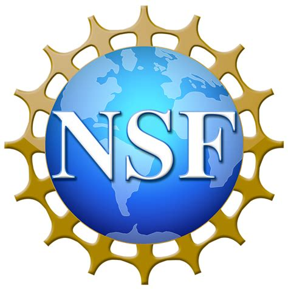

# Data Sceintist

#### Technical Skills: Python, SQL, AWS, NLP, Machine Learning

### Education
Computer Sceince, M.S.

### Work Experience
**Research Assistant @ SUNY at Binghaton (_Jan 2021 - Present_)**
- Conducted data collection, processing, and analysis for different social study projects using social media data.
- Applied different NLP techniques, supervised and unsupervised deep learning approaches, and statistical methods

## Projects
### Driver Identification using smarphones sensors (The project was partially funded by NSF )[Publication 1](https://dl.acm.org/doi/abs/10.1145/3241539.3267769), [Publication 2](https://ieeexplore.ieee.org/abstract/document/9209713)

- Developed a low cost system to identify drivers on a single turning event with above 90% accuracy.
- Considered different driving/turning scenarios such as turn on intesection with/without stop signs.
- Extracted feaures from different smart phone sensors including Gyroscope, Accelerometer are used to reflect unique drivers.
- Developed a multi-stage GBT classifer to increase the accuracy.
- Technologies:Android, SQLite, Apache, MATLAB, Signal processing, Statistics, Feature extraction, GBT.
  
### Studied the use of Fauxtography and spread of misinformation on social media. [Publication](https://arxiv.org/pdf/2009.11792.pdf)

- The first large-scale study of fauxtography, analyzed the use of manipulated or misleading images in news discussion on online communities.
- Showed that fauxtography images are often turned into memes by Web communities.
- Technologies: Python, hypothesis testing, image classification.

### Studied sinophobic behaviors on social media during COVID-19 outbreak. [Publication](https://arxiv.org/pdf/2009.11792.pdf](https://ui.adsabs.harvard.edu/abs/2020arXiv200404046T/abstract)https://ui.adsabs.harvard.edu/abs/2020arXiv200404046T/abstract)
#### News Coverage [USA Today](https://www.usatoday.com/story/tech/2021/03/24/asian-american-hate-crimes-covid-harassment-atlanta-google-facebook-youtube/6973659002/), [Washington Post](https://www.washingtonpost.com/technology/2020/04/08/coronavirus-spreads-so-does-online-racism-targeting-asians-new-research-shows/)

- Technologies: Python, NLP, Parallel processing, genism, GoogleAPIs.
